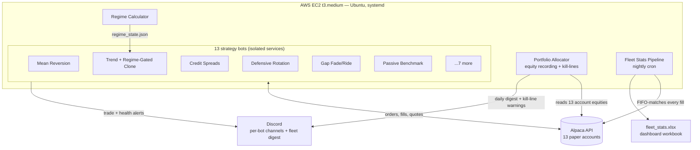

# Trading Fleet Infrastructure

A 13-strategy algorithmic paper-trading platform running 24/7 on a single AWS EC2 instance. Every strategy runs as an isolated, supervised Linux service with its own brokerage account, risk limits, alerting channel, and log rotation — coordinated by a shared risk engine and a nightly analytics pipeline.

**This is an infrastructure project.** The interesting part is not any single trading strategy — it's the operational engineering: running 15 unattended Python services against live market data, keeping them alive through failures, catching their bugs from their logs, and holding every strategy accountable to a passive benchmark. All trading is paper (simulated money, live market data) through the Alpaca API. No performance claims are made anywhere in this repo, deliberately: with weeks of live data, any results are statistical noise, and pretending otherwise is how retail algo projects lie to themselves.

Built and operated by a 19-year-old plant engineering supervisor who spends nights keeping conveyor systems alive at UPS Worldport and applied the same reliability mindset here.

## Architecture



## What's actually running

| Component | Role |
|---|---|
| **13 strategy bots** | Each an independent Python service with its own $100k paper account. Six representative bots are in this repo (see below). |
| **Regime Calculator** | Computes a daily market regime (breadth, SPY trend, volatility proxy) and publishes it to a shared state file that regime-aware bots consume. |
| **Portfolio Allocator** | The risk engine. Records every account's equity daily, maintains fleet history, and enforces per-strategy kill-lines — drawdown limits that flag a strategy for shutdown. |
| **Fleet Stats Pipeline** | Nightly cron job that pulls every fill from all 13 accounts, FIFO-matches them into realized P/L per ticker per bot (validated to the penny against broker records), and rebuilds a dashboard workbook: leaderboard with kill-line headroom, per-day P/L heat map, equity curves. |
| **systemd supervision** | Every process runs as a unit with auto-restart, memory caps (`MemoryMax`), and log redirection. The fleet survives crashes, reboots, and memory leaks without intervention. |
| **Log rotation** | All 15+ service logs enrolled in logrotate with compression. |
| **Discord alerting** | Every bot posts entries, exits, and errors to its own channel; the allocator posts a nightly fleet digest. Green/red at a glance. |

## The six bots in this repo

Thirteen bots run in production, but several are controlled variants of each other (that's the experiment). The six here each demonstrate a distinct engineering pattern:

| Bot | Pattern it demonstrates |
|---|---|
| [`bots/mean-reversion`](bots/mean-reversion) | Shares strategy: rolling statistical bands, bracket orders, position sizing |
| [`bots/credit-spreads`](bots/credit-spreads) | Options: multi-leg orders, a proper position state machine (`pending_entry → open → pending_close`), fill confirmation via order-by-id instead of trusting submission |
| [`bots/trend-regime`](bots/trend-regime) | Shared-state consumption: identical to its control twin except for one variable — a regime gate read from the Regime Calculator — for a clean A/B experiment |
| [`bots/defensive-rotation`](bots/defensive-rotation) | Dual-momentum rotation between risk-on/risk-off assets |
| [`bots/gap-fade`](bots/gap-fade) | Event-driven logic: classifies overnight gaps at the open into fade / ride / stand-down zones, hard time-based flatten |
| [`bots/benchmark`](bots/benchmark) | The control: buys SPY once and holds. Exists so every active strategy is measured against doing nothing. |

## Design principles

**One variable per experiment.** Strategy variants differ from their control by exactly one mechanism (a regime gate, a different band anchor), and their entry scans are synchronized to wall-clock boundaries so timing differences can't contaminate the comparison.

**The benchmark keeps everyone honest.** A passive SPY bot with the same account size runs alongside the fleet. Any strategy that can't beat it is measurably not earning its complexity.

**Orders are not fills.** Every options bot confirms fills via `get_order_by_id()` and records actual fill prices. Trusting order submission as confirmation is how state files drift from reality.

**Sizing is survival, not optimization.** Default 1% risk per trade, hard-capped, always rounded down. Kill-lines bound each strategy's maximum damage to the experiment.

**Freeze failures as data.** When a strategy family underperforms, the temptation is to patch it live. Unless the cause is a bug, the discipline here is to leave it untouched and let it document *when* the approach fails.

**Measure before building.** [`tools/spread_audit.py`](tools/spread_audit.py) is a read-only script that sampled crypto spreads for days before any crypto strategy was considered — the data killed most of the candidate universe before a line of strategy code was written.

## Reliability lessons (the short version)

The full war stories are in [`docs/lessons-learned.md`](docs/lessons-learned.md). Highlights:

- **A frozen indicator that only froze sometimes.** Bars fetched with `date.today()` and a small limit returned *oldest-first* data from the provider — the bot was trading on stale closes. The fix (anchor the window to `now(UTC) - 5 days`, request large, slice newest) is now the standard pattern in every bot.
- **CRLF as a production hazard.** Any file that transits a Windows machine can pick up `\r` line endings that silently corrupt env vars (webhook URLs that 400, keys that fail auth). `sed -i 's/\r$//'` is now a mandatory deployment step.
- **Logrotate that failed for a week without anyone noticing.** A stray editor backup file (`.save`) in `/etc/logrotate.d/` made the entire logrotate service fail nightly. Found during a routine audit; the lesson is that infrastructure needs auditing even when nothing looks wrong.
- **Webhooks are the most error-prone config in the fleet.** Three different failure modes (empty channel, malformed URL, CRLF corruption) led to a standing rule: every webhook is verified with a curl returning HTTP 204 *and* eyes on the message in the target channel before a bot is considered deployed.

## Repo layout

```
bots/                  six representative strategy services
allocator/             risk engine: equity recording, kill-lines, fleet digest
regime/                daily market regime calculator (shared state producer)
fleetstats/            nightly analytics: FIFO fill matching → Excel dashboard
tools/                 read-only utilities (crypto spread audit)
deploy/systemd/        the actual unit files the fleet runs under
deploy/logrotate/      log rotation config for all services
docs/                  architecture deep-dive, lessons learned, deployment checklist
.env.example           required configuration (no real values)
```

## Running a bot

Each bot needs its own Alpaca paper account and a `.env` (see [`.env.example`](.env.example)). The deployment checklist in [`docs/deployment.md`](docs/deployment.md) is the real process used in production — including the verification steps that exist because skipping them caused incidents.

```bash
cp .env.example bots/mean-reversion/.env   # fill in keys + webhook
sudo cp deploy/systemd/meanrev-bot.service /etc/systemd/system/
sudo systemctl enable --now meanrev-bot
journalctl -u meanrev-bot -f
```

## Stack

Python · alpaca-py · systemd · logrotate · cron · openpyxl · Discord webhooks · AWS EC2 (Ubuntu)

## Honest limitations

- **Paper fills are optimistic.** No real slippage, no market impact. Decision-vs-fill logging is planned before any strategy would touch real money.
- **Weeks of data prove nothing about strategies.** The infrastructure is proven; the strategies are an ongoing experiment against their benchmark and each other.
- **Single instance, no failover.** An EC2 outage stops the fleet. Acceptable for paper trading; the monitoring would catch it within a day.

---

*Built with AI-assisted development. Architecture, debugging, and every operational decision are my own — and I can walk you through any line of it.*
